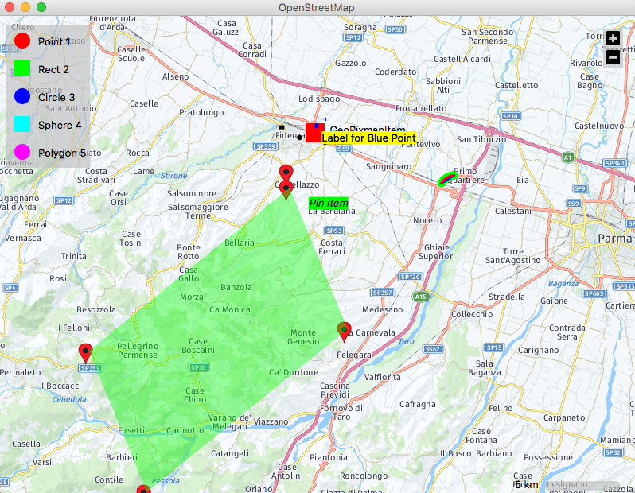

# PyTileMap

PyQt Map System forked from:

https://github.com/allebacco/PyTileMap

Simple to use map widget that can be used in a PyQt GUI.

# Install:
python setup.py install

# Example:

examples/main_gs.py

# Map Widgets

- MapGraphicsLineItem - a line between two lat/lon points
- MapGraphicsPolyLineItem - lines between a series of lat/lon points
- MapGraphicsPixmapItem - place a pixmap at a given lat/lon (does not scale with map zoom)
- MapGraphicsTextItem - place text at a given lat/lon
- MapGraphicsLinesGroupItem - a group of lines
- MapGraphicsCircleItem - draw a circle centered at a lat/lon
- MapGraphicsRectItem - draw a rectangle given upper left and lower right lat/lon  (scales with zoom)
- MapGraphicsRectShapeItem - draw a rectangle with a fixed with and height (does not scale with zoom)
- MapGraphicsGeoSvgItem - draw an svg given upper left and lower right lat/lon (scales with zoom)
- MapGraphicsGeoPixmapItem - draw a pixmap given upper left and lower right lat/lon (scales with zoom)
- MapGraphicsGeoPixmapItemCorners - draw a pixmap given all four lat/lon corners (scales with zoom)
- MapGraphicsLabelItem - a label that is attached to another map item

# Screenshot

